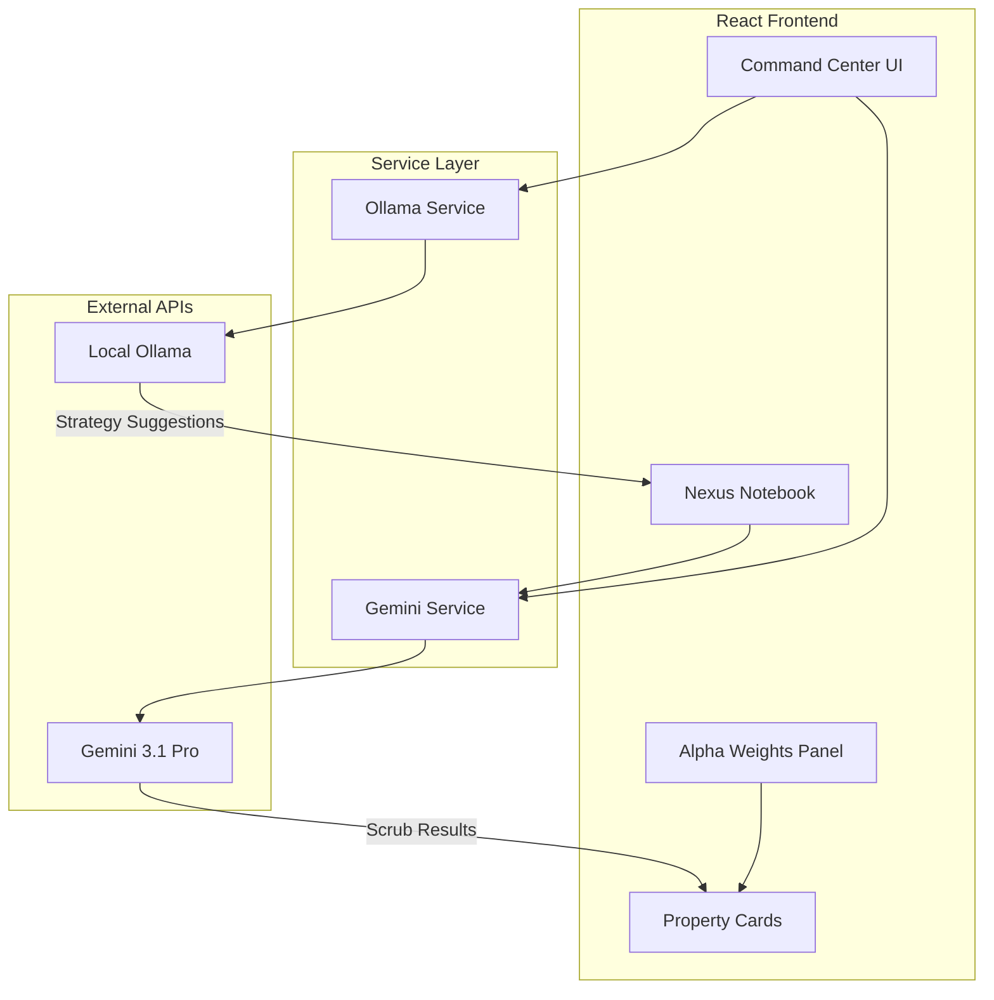

# NexusNights Intelligence Engine - Improvement Plan

## Executive Summary

After analyzing the codebase, I've identified several improvements to enhance the NexusNights Intelligence Engine. These range from critical bug fixes to UX enhancements and architectural improvements.

---

## 🔴 Critical Fixes

### 1. Alpha Weights Total Display (HIGH PRIORITY)

**Issue:** The Alpha Weights sliders don't show a total sum indicator, making it unclear if they equal 100%.

**Current Behavior:**
- The [`handleWeightChange()`](App.tsx:122) function correctly redistributes weights to maintain 100% total
- However, there's no visual confirmation that weights sum to 100%

**Solution:**
```tsx
// Add a total weight indicator in the Alpha Weights panel
const totalWeight = WEIGHT_KEYS.reduce((sum, key) => sum + weights[key], 0);

// Display in UI
<div className="flex justify-between items-center mb-4">
  <span className="text-xs text-white/40">TOTAL WEIGHT</span>
  <span className={cn(
    "text-lg font-black",
    totalWeight === 100 ? "text-[#38E8C6]" : "text-red-500"
  )}>
    {totalWeight}%
  </span>
</div>
```

**Location:** [`App.tsx`](App.tsx:840) - Add before the info box in the Alpha Weights panel

---

### 2. Weight Redistribution Edge Cases

**Issue:** When adjusting weights rapidly, rounding errors can cause the total to drift from 100%.

**Current Logic in [`handleWeightChange()`](App.tsx:122):**
- Uses `Math.round()` which can accumulate rounding errors
- The last weight gets the remainder, but this can result in negative values in edge cases

**Solution:**
```tsx
const handleWeightChange = (key: keyof AlphaWeights, value: number) => {
  const clamped = Math.max(0, Math.min(100, value));
  const otherKeys = WEIGHT_KEYS.filter(k => k !== key);
  const remaining = 100 - clamped;
  
  const next: AlphaWeights = { ...weights, [key]: clamped };
  
  if (remaining <= 0) {
    otherKeys.forEach(k => { next[k] = 0; });
  } else {
    const totalOthers = otherKeys.reduce((sum, k) => sum + weights[k], 0);
    if (totalOthers === 0) {
      // Distribute evenly
      const base = Math.floor(remaining / otherKeys.length);
      let leftover = remaining - (base * otherKeys.length);
      otherKeys.forEach(k => {
        next[k] = base + (leftover > 0 ? 1 : 0);
        if (leftover > 0) leftover--;
      });
    } else {
      // Proportional redistribution with guaranteed 100% total
      let assigned = 0;
      otherKeys.forEach((k, idx) => {
        if (idx === otherKeys.length - 1) {
          next[k] = Math.max(0, remaining - assigned);
        } else {
          const proportion = weights[k] / totalOthers;
          const newValue = Math.round(proportion * remaining);
          next[k] = Math.max(0, newValue);
          assigned += next[k];
        }
      });
    }
  }
  
  setWeights(next);
};
```

---

## 🟡 UX Enhancements

### 3. Weight Slider Visual Feedback

**Enhancement:** Add haptic-style visual feedback when adjusting weights.

```tsx
// Add a "lock" toggle for each weight
interface WeightLock {
  [key: string]: boolean;
}

const [lockedWeights, setLockedWeights] = useState<WeightLock>({});

// UI: Add lock icon next to each weight
<button 
  onClick={() => toggleLock(item.key)}
  className={cn(
    "p-1 rounded transition-colors",
    lockedWeights[item.key] ? "text-[#D9FF00]" : "text-white/20"
  )}
>
  <Lock className="w-4 h-4" />
</button>
```

### 4. Keyboard Shortcuts for Power Users

**Enhancement:** Add keyboard shortcuts for common actions.

| Shortcut | Action |
|----------|--------|
| `Ctrl+S` | Scrub current region |
| `Ctrl+N` | Add new notebook entry |
| `Ctrl+R` | Reset weights to default |
| `Escape` | Close modals |
| `1-5` | Focus on weight slider 1-5 |

```tsx
useEffect(() => {
  const handleKeyDown = (e: KeyboardEvent) => {
    if (e.ctrlKey && e.key === 's') {
      e.preventDefault();
      handleScrub();
    }
    // ... more shortcuts
  };
  
  window.addEventListener('keydown', handleKeyDown);
  return () => window.removeEventListener('keydown', handleKeyDown);
}, []);
```

### 5. Mobile Responsiveness

**Issue:** The three-column layout doesn't adapt well to mobile screens.

**Solution:**
```tsx
// Use responsive Tailwind classes
<main className="flex flex-col lg:flex-row">
  {/* Notebook - Full width on mobile, sidebar on desktop */}
  <aside className="w-full lg:w-80 order-2 lg:order-1">
    ...
  </aside>
  
  {/* Main content */}
  <section className="flex-1 order-1 lg:order-2">
    ...
  </section>
  
  {/* Weights - Collapsible on mobile */}
  <aside className="w-full lg:w-80 order-3">
    ...
  </aside>
</main>
```

---

## 🟢 Feature Additions

### 6. Ollama Sidekick Robustness

**Enhancement:** Add connection status indicator and auto-reconnect.

```tsx
const [ollamaStatus, setOllamaStatus] = useState<'connected' | 'disconnected' | 'checking'>('checking');

const checkOllamaConnection = async () => {
  try {
    const response = await fetch(`${ollamaEndpoint}/api/tags`);
    setOllamaStatus(response.ok ? 'connected' : 'disconnected');
  } catch {
    setOllamaStatus('disconnected');
  }
};

// Auto-check every 30 seconds when sidekick is enabled
useEffect(() => {
  if (sidekickEnabled) {
    checkOllamaConnection();
    const interval = setInterval(checkOllamaConnection, 30000);
    return () => clearInterval(interval);
  }
}, [sidekickEnabled, ollamaEndpoint]);
```

### 7. Error Handling for API Failures

**Enhancement:** Add graceful error handling with retry logic.

```tsx
const scrubWithRetry = async (region: string, retries = 3): Promise<Property[]> => {
  for (let i = 0; i < retries; i++) {
    try {
      return await gemini.scrubRegion(region, weights, notebook);
    } catch (error) {
      if (i === retries - 1) throw error;
      await new Promise(r => setTimeout(r, 1000 * (i + 1))); // Exponential backoff
    }
  }
  return [];
};
```

### 8. Market Pulse Validation

**Enhancement:** Add data quality indicators to Market Pulse stats.

```tsx
interface MarketPulseData {
  avgADR: number;
  avgOccupancy: number;
  totalAlphaOpportunity: number;
  dataQuality: 'high' | 'medium' | 'low';
  sampleSize: number;
}

const calculateMarketPulse = (properties: Property[]): MarketPulseData => {
  const sampleSize = properties.length;
  const dataQuality = sampleSize >= 10 ? 'high' : sampleSize >= 5 ? 'medium' : 'low';
  
  return {
    avgADR: properties.reduce((sum, p) => sum + p.current_adr, 0) / sampleSize,
    avgOccupancy: properties.reduce((sum, p) => sum + p.occupancy_rate, 0) / sampleSize,
    totalAlphaOpportunity: properties.reduce((sum, p) => 
      sum + (p.market_comp_revenue - p.estimated_annual_revenue), 0
    ),
    dataQuality,
    sampleSize
  };
};
```

---

## 🔧 Developer Experience

### 9. Environment Setup

**Create `.env.example`:**
```env
# Required: Gemini API Key for AI-powered analysis
GEMINI_API_KEY=your_gemini_api_key_here

# Optional: Ollama endpoint for local sidekick
OLLAMA_ENDPOINT=http://localhost:11434
OLLAMA_MODEL=llama3.1:8b
```

### 10. TypeScript Strict Mode

**Enhancement:** Enable stricter TypeScript checks in [`tsconfig.json`](tsconfig.json).

```json
{
  "compilerOptions": {
    "strict": true,
    "noImplicitAny": true,
    "strictNullChecks": true,
    "noUnusedLocals": true,
    "noUnusedParameters": true
  }
}
```

---

## Architecture Diagram



---

## Implementation Priority

| Priority | Item | Complexity | Impact |
|----------|------|------------|--------|
| 1 | Alpha Weights Total Display | Low | High |
| 2 | Weight Redistribution Fix | Medium | High |
| 3 | Error Handling | Medium | High |
| 4 | .env.example | Low | Medium |
| 5 | Ollama Status Indicator | Low | Medium |
| 6 | Mobile Responsiveness | High | Medium |
| 7 | Keyboard Shortcuts | Medium | Low |
| 8 | Weight Lock Feature | Medium | Low |

---

## Next Steps

1. **Immediate:** Fix the Alpha Weights total display issue
2. **Short-term:** Add error handling and .env.example
3. **Medium-term:** Implement mobile responsiveness
4. **Long-term:** Add keyboard shortcuts and weight locking

---

*NexusNights: Identify the Gap. Execute the Alpha.*
